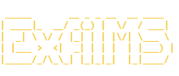

\
[![NPM version][npm-image]][npm-url]
[![build status][ci-image]][ci-url]
[![Test coverage][codecov-image]][codecov-url]
[![npm download][download-image]][download-url]

## Introduction

ExfilMS is a cross-platform, command line interface (CLI) tool to extract MS data from mzML formatted files, with spectrum filtering capabilities.\
<br>

### Features:

- Precision value rounding
- Spectra filtering (m/z and intensity)
  - Targeted (target file, m/z tolerance and ppm tolerance)
  - Range (minimum and maximum m/z)
- Spectrum data filtering
  - Spectrum type (profile / centroid)
  - MS level
  - Polarity (positive / negative)
  - Exclude spectra (m/z and intensity)

<br>

## Installation

> ExfilMS has been tested on Windows, macOS and Linux.

### Node.js

> [!IMPORTANT]\
> _Prerequisite:_ [Node.js®][nodejs-url]

```md
# Clone repository

$ git clone https://github.com/vmalnathnambiar/exfilms.git

# Navigate into repository

$ cd exfilms

# Install dependencies

$ npm install

# Install CLI

$ npm install -g .
```

or

`$ npm install -g exfilms`

<br>

### Docker

> [!IMPORTANT]\
> _Prerequisite:_ [Docker][docker-url]

```md
# Clone repository

$ git clone https://github.com/vmalnathnambiar/exfilms.git

# Navigate into repository

$ cd exfilms

# Build Docker image

$ docker build -t exfilms .
```

or

`$ docker pull exfilms`

<br>

## Usage

### Node.js

```md
$ exfilms -i (or --inputDirectory) "/path/to/input/directory/containing/mzML/data/files/" ...
```

<br>

### Docker

```md
$ docker run --rm -it -v "/path/to/input/directory/":/inputDirectory -v "/path/to/output/directory/":/outputDirectory -v "/path/to/log/directory/":/logDirectory exfilms -i /inputDirectory -o /outputDirectory -l /logDirectory ....
```

> [!Warning]\
> Appending `-x` to the ExfilMS image in the Docker command to run in interactive mode instead of appending command line flags (like shown above) to configure the tool's behaviour is currently not working as intended. This is a known issue and we are working to resolve it as soon as possible.

<br>

For more guidance on how to use ExfilMS, please refer to our available guides below:

- [Data Conversion to mzML using ProteoWizard](./doc/data-conversion-to-mzml-using-proteowizard.md)
- [How To ExfilMS: The Complete Guide](./doc/how-to-exfilms-the-complete-guide.md)

<br>

## Citations

If you use ExfilMS in your work, please cite it using the following:

<a id="1">[1]</a>

<br>

<!-- ## API Documentation
Please refer to our API documentation [here](https://vmalnathnambiar.github.io/exfilms/). -->

## License

Please refer to our license information [here](./LICENSE).

<!-- URLs used in the markdown document-->

[npm-image]: https://img.shields.io/npm/v/exfilms.svg
[npm-url]: https://www.npmjs.com/package/exfilms
[ci-image]: https://github.com/vmalnathnambiar/exfilms/workflows/Node.js%20CI/badge.svg?branch=main
[ci-url]: https://github.com/vmalnathnambiar/exfilms/actions?query=workflow%3A%22Node.js+CI%22
[codecov-image]: https://img.shields.io/codecov/c/github/vmalnathnambiar/exfilms.svg
[codecov-url]: https://codecov.io/gh/vmalnathnambiar/exfilms
[download-image]: https://img.shields.io/npm/dm/exfilms.svg
[download-url]: https://www.npmjs.com/package/exfilms
[nodejs-url]: https://nodejs.org/en/download/
[docker-url]: https://docs.docker.com/engine/install/
